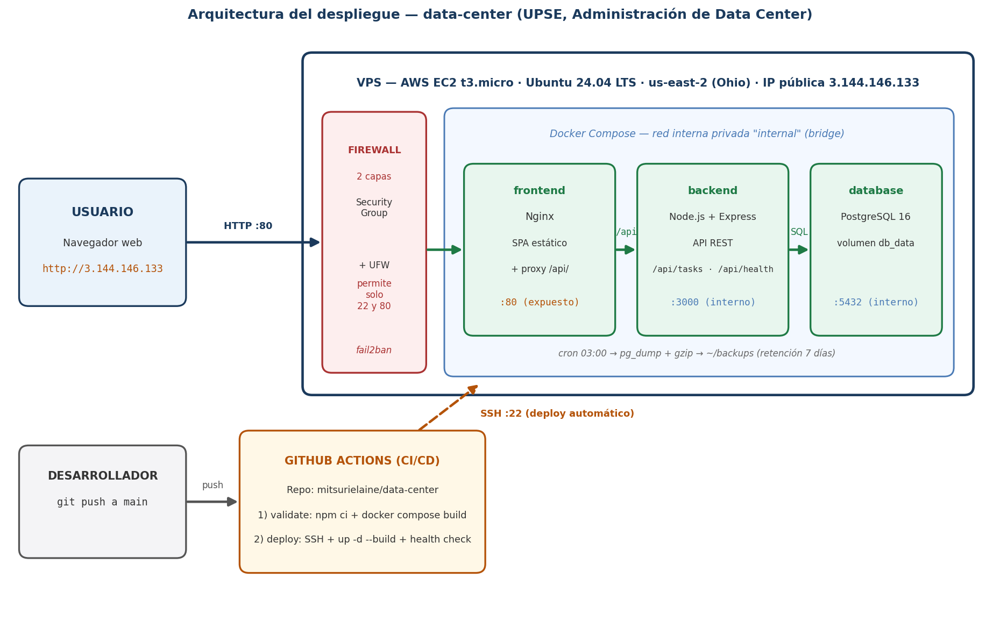

# Trabajo Práctico: Despliegue Automatizado y Administración de Servicios en VPS

**Materia:** Administración de Data Center
**Docente:** Ing. Carlos Muñoz M.
**Autor:** Marisa Eliana Matias Alcivar

> Esta plantilla sigue exactamente las 4 secciones que exige el enunciado (punto 2) y los 5
> criterios de la rúbrica (punto 3). Cada `[COMPLETAR: ...]` se llena con datos reales una vez
> hecho el despliegue — no se inventa nada, se documenta lo que realmente pasó (incluyendo
> errores y cómo se resolvieron, como pide una bitácora real).

---

## 1. Diseño de la Infraestructura

*(Rúbrica 4.1 — Infraestructura: "instalación impecable, servicios optimizados y seguros")*

### 1.1 Descripción general

La aplicación se ejecuta en una única instancia EC2 de AWS mediante contenedores Docker
orquestados con Docker Compose. Tres servicios conforman el stack: un contenedor **frontend**
(Nginx sirviendo el SPA estático y actuando como proxy inverso hacia la API), un contenedor
**backend** (API REST en Node.js/Express) y un contenedor **database** (PostgreSQL 16). Los tres
se comunican mediante una red bridge privada de Docker (`internal`); solo Nginx publica el
puerto 80 hacia internet.

Acceso: `http://3.144.146.133` (sin dominio propio, según lo definido para este
trabajo).

### 1.2 Diagrama de arquitectura

Usuario → HTTP:80 → VPS AWS EC2 (3.144.146.133) → [Security Group + UFW] → frontend
(Nginx:80, único puerto expuesto) → backend (Node/Express:3000, red interna) → database
(PostgreSQL 16:5432, red interna). En paralelo: desarrollador → push a `main` → GitHub
Actions (validate + deploy por SSH:22) → VPS.

### 1.3 Componentes principales

| Componente | Tecnología | Función |
|---|---|---|
| Instancia VPS | AWS EC2 t3.micro, Ubuntu 24.04 LTS | Servidor real con IP pública 3.144.146.133 (región us-east-2, Ohio) |
| Frontend | Nginx + HTML/CSS/JS | Sirve el SPA, proxy `/api/` hacia el backend |
| Backend | Node.js + Express | API REST (`/api/tasks`, `/api/health`), solo en red interna |
| Database | PostgreSQL 16 | Persiste las tareas; puerto 5432 solo accesible internamente |
| Orquestación | Docker Compose | `docker-compose.yml` versionado en Git |
| CI/CD | GitHub Actions | Valida y despliega por SSH ante cada push a `main` |
| Firewall de red | AWS Security Group | Filtra 22/80 a nivel de nube |
| Firewall de sistema | UFW | Segunda capa de filtrado dentro del VPS |
| Respaldos | cron + `pg_dump` + gzip | Respaldo diario con retención de 7 días |

---

## 2. Proceso de Provisionamiento

*(Rúbrica — bitácora de instalación y configuración: puertos abiertos, usuarios, permisos)*

> Completar como tabla cronológica real, basada en lo ejecutado siguiendo `GUIA_DESPLIEGUE.md`.
> Incluir cualquier problema real que haya surgido y cómo se resolvió (por ejemplo, si el SSH no
> conectaba, si hubo que ajustar memoria, etc.) — eso demuestra manejo real del entorno, no solo
> haber copiado comandos.

| Paso | Actividad | Detalle |
|---|---|---|
| 1 | Cuenta AWS | Cuenta free plan (ID 705061159695), región us-east-2 (Ohio). Alerta de presupuesto creada con la plantilla *Zero spend budget* (notifica al superar $0,01; la plantilla muestra $1 como monto nominal interno, lo cual generó una duda inicial que se aclaró leyendo la descripción de la propia plantilla). |
| 2 | Security Group | `data-center-sg` (sg-053023b53ec696b20). Entrada: SSH 22 solo desde la IP del administrador (181.211.216.101/32, opción "Mi IP") y HTTP 80 desde 0.0.0.0/0. Detalle real: la regla HTTP quedó inicialmente con origen "Personalizada" vacío y hubo que corregirla a "Cualquier lugar-IPv4" antes de crear el grupo. Salida: todo permitido (por defecto). |
| 3 | Lanzamiento de instancia | `data-center-vps` (i-0962f700486021b25), t3.micro (apto capa gratuita), AMI Ubuntu Server 24.04 LTS (ami-0ea1cddefe0c4aed5), zona us-east-2c, disco 20 GiB gp3. Key pair RSA `data-center-key.pem` generado al lanzar. IP pública asignada: 3.144.146.133. |
| 4 | Conexión SSH | Directa con OpenSSH de Windows: `ssh -i data-center-key.pem ubuntu@3.144.146.133`. Problema real: el primer intento falló con `WARNING: UNPROTECTED PRIVATE KEY FILE` / `bad permissions` porque el `.pem` heredaba permisos de lectura de otros grupos del sistema. Se resolvió con `icacls data-center-key.pem /inheritance:r /grant:r "%USERNAME%:R"` (quita la herencia y deja solo lectura para el usuario dueño). Segundo intento: conexión exitosa a Ubuntu 24.04.4 LTS. |
| 5 | Actualización del sistema | `sudo apt update && sudo apt upgrade -y` (con `NEEDRESTART_MODE=a` para evitar diálogos interactivos): 75 paquetes actualizados + kernel nuevo 6.17.0-1019-aws instalado (63 actualizaciones de seguridad LTS). Se reinició la instancia para cargar el kernel pendiente. También se creó un swapfile de 1 GiB (persistente vía `/etc/fstab`) como colchón de RAM para los builds de Docker en t3.micro (1 GiB de RAM). |
| 6 | Firewall UFW | `ufw allow 22/tcp`, `ufw allow 80/tcp`, `ufw --force enable`. `sudo ufw status` → Status: active, con 22/tcp y 80/tcp ALLOW Anywhere (IPv4 e IPv6); todo lo demás bloqueado por defecto. |
| 7 | Instalación de Docker | Repositorio oficial de Docker (clave GPG en `/etc/apt/keyrings/docker.gpg`). Instalado: docker-ce 29.6.2, containerd 2.2.6, docker-compose-plugin 5.3.1. Usuario `ubuntu` agregado al grupo `docker` (aplicado tras reiniciar la sesión). |
| 8 | Clonado del repositorio | Se generó una deploy key ED25519 dedicada en el VPS (`~/.ssh/deploy_key`) y se registró en el repo vía API de GitHub con `"read_only": true` (el servidor solo puede leer, nunca escribir). Con `~/.ssh/config` apuntando a esa llave, `git clone git@github.com:mitsurielaine/data-center.git ~/data-center` clonó sin problemas. |
| 9 | Variables de entorno | `.env` creado a partir de `.env.example`; `DB_PASSWORD` generada directamente en el servidor con `openssl rand -hex 20` (nunca pasó por el chat ni quedó versionada — `.env` está en `.gitignore`). |
| 10 | Primer despliegue | `docker compose up -d --build`: build completo en ~9 s (t3.micro con swap, sin cuelgues). `docker compose ps`: `data-center-db` (postgres:16-alpine) **healthy**, `data-center-backend` y `data-center-frontend` **Up**; solo el frontend publica `0.0.0.0:80->80`. `curl http://localhost/api/health` → `{"status":"ok","db":"connected"}`. |
| 11 | Verificación funcional | `http://3.144.146.133/api/health` respondió `{"status":"ok","db":"connected"}` desde internet (verificado desde fuera de la red del VPS). CRUD probado manualmente en el navegador vía IP pública: se creó la tarea "Prueba de url", se marcó como completada, se probó el filtro por título y la eliminación. El panel muestra los contadores (pendientes/completadas/total) sincronizados con la base. | |
| 12 | fail2ban | Instalado fail2ban 1.0.2 con el jail `sshd` activo (`systemctl enable --now fail2ban`). Mitiga fuerza bruta sobre SSH, necesario porque el puerto 22 se abrió a 0.0.0.0/0 para los runners de GitHub Actions (IPs dinámicas). |
| 13 | Respaldos automáticos | Cron diario 03:00 con `pg_dump` + gzip, retención 7 días |

---

## 3. Configuración del Pipeline CI/CD

*(Rúbrica — Automatización CI/CD: "los cambios locales se reflejan solos en el VPS")*

### 3.1 Descripción general

El pipeline se define en `.github/workflows/deploy.yml` y corre ante cada `push` o `pull request`
contra `main`. Tiene dos jobs secuenciales: `validate` y `deploy` (este último solo en eventos
`push`, y depende de que `validate` pase).

### 3.2 Job `validate`

Descarga el código, instala dependencias del backend (`npm ci`), valida su sintaxis, valida la
sintaxis de `docker-compose.yml` (`docker compose config --quiet`) y construye las imágenes
(`docker compose build`) para confirmar que el proyecto compila de extremo a extremo antes de
tocar producción.

### 3.3 Job `deploy`

Se conecta por SSH real al VPS (acción `appleboy/ssh-action`, autenticada con una llave privada
guardada como secreto de GitHub) y ejecuta: `git fetch` + `git reset --hard origin/main`,
`docker compose up -d --build`, `docker image prune -f`, y finalmente un `curl` contra
`/api/health` que hace fallar el job si la app no responde tras el despliegue.

### 3.4 Secretos utilizados

| Secreto | Propósito |
|---|---|
| `VPS_HOST` | `3.144.146.133` (IP pública de la instancia) |
| `VPS_USER` | `ubuntu` |
| `VPS_SSH_KEY` | Llave privada dedicada al pipeline (distinta de la personal y de la deploy key) |
| `VPS_PORT` | `22` |

### 3.5 Evidencia de funcionamiento

Dato real de la bitácora: la **primera** ejecución del workflow (disparada por el push inicial del
proyecto, antes de existir el VPS y los secretos) falló en el job `deploy` — comportamiento esperado
que confirmó que el pipeline no despliega si no puede conectarse al servidor.

Prueba definitiva: se editó una línea del `frontend/index.html` (se agregó el texto "Desplegado
automáticamente con GitHub Actions.") y se hizo push a `main` (commit `565b797`). El workflow corrió
`validate` (npm ci + verificación de sintaxis + `docker compose config` + build de imágenes) y luego
`deploy` (SSH real al VPS, `git reset --hard origin/main`, `docker compose up -d --build`, health
check con `curl`). En ~3 minutos el cambio quedó visible en `http://3.144.146.133` **sin tocar el
VPS manualmente**, verificado desde fuera de la red del servidor.

---

## 4. Plan de Mantenimiento y Seguridad

*(Rúbrica 4.4 — "firewall configurado, respaldos automatizados y logs revisados")*

### 4.1 Firewall en dos capas
- **AWS Security Group**: permite únicamente 22 (SSH) y 80 (HTTP). El 22 se restringió inicialmente a la IP del administrador ("Mi IP") y se abrió a 0.0.0.0/0 recién al configurar el pipeline (los runners de GitHub Actions no tienen IP fija), riesgo mitigado con fail2ban. El 80 está abierto a 0.0.0.0/0 por ser el servicio web público.
- **UFW** (sistema operativo): misma política de puertos, segunda capa independiente.
- El backend (3000) y la base de datos (5432) nunca se exponen fuera de la red interna de Docker.

### 4.2 Respaldo de la base de datos
Script `~/backups/backup-db.sh` ejecuta `pg_dump` sobre la base, comprime con `gzip` y elimina
respaldos de más de 7 días. Cron diario a las 03:00 (`0 3 * * *`, verificado con `crontab -l`).
Prueba manual ejecutada con éxito: se generó `tasksdb_2026-07-24_022013.sql.gz` (976 B comprimido)
en `~/backups/`, con log de ejecuciones en `~/backups/backup.log`.

### 4.3 Gestión de secretos
Ningún secreto (contraseña de base de datos, llaves privadas) está versionado en Git — `.env`
está excluido vía `.gitignore`. Las credenciales del pipeline viven únicamente como GitHub
Actions Secrets, cifrados y ocultos en los logs.

### 4.4 Recomendaciones futuras
Copiar los respaldos fuera de la instancia (por ejemplo a un bucket S3 con ciclo de vida) para
sobrevivir a la pérdida del volumen; restringir el puerto 22 a los rangos de IP publicados por
GitHub Actions (`api.github.com/meta`) en lugar de 0.0.0.0/0; habilitar `unattended-upgrades`
para parches de seguridad automáticos; agregar HTTPS con un certificado de Let's Encrypt usando
un subdominio gratuito tipo nip.io; y configurar alarmas de CloudWatch (CPU, disco, estado) para
detectar incidentes sin entrar al servidor.

---

## 5. Conclusión

La infraestructura desplegada cumple los cuatro requisitos técnicos del enunciado: un VPS real
(AWS EC2 t3.micro con Ubuntu 24.04, IP pública 3.144.146.133), un stack completo de tres capas con
base de datos relacional (Nginx + Node.js/Express + PostgreSQL 16, orquestado con Docker Compose
sobre una red interna privada), un pipeline de CI/CD que valida y despliega automáticamente por SSH
en cada push a `main` (verificado con un despliegue real de extremo a extremo), y un plan de
mantenimiento con firewall en dos capas (Security Group + UFW), fail2ban y respaldos diarios
automatizados de la base de datos. Todo el proceso quedó documentado como bitácora real, incluyendo
los problemas encontrados y su resolución.

## 6. Anexos

- Anexo 1: Instancia EC2 `data-center-vps` en ejecución en la consola de AWS (IP 3.144.146.133).
- Anexo 2: Reglas de entrada del Security Group `data-center-sg` (SSH 22 y HTTP 80).
- Anexo 3: Pestaña Actions de GitHub — run #2 en verde (`validate` 16s + `deploy` 24s) tras el push de prueba; run #1 en rojo (push inicial, antes de existir el VPS).
- Anexo 4: `docker compose ps` en el VPS mostrando los 3 contenedores (db healthy, backend y frontend up).
- Anexo 5: La aplicación funcionando en el navegador vía `http://3.144.146.133` (CRUD sobre PostgreSQL).
